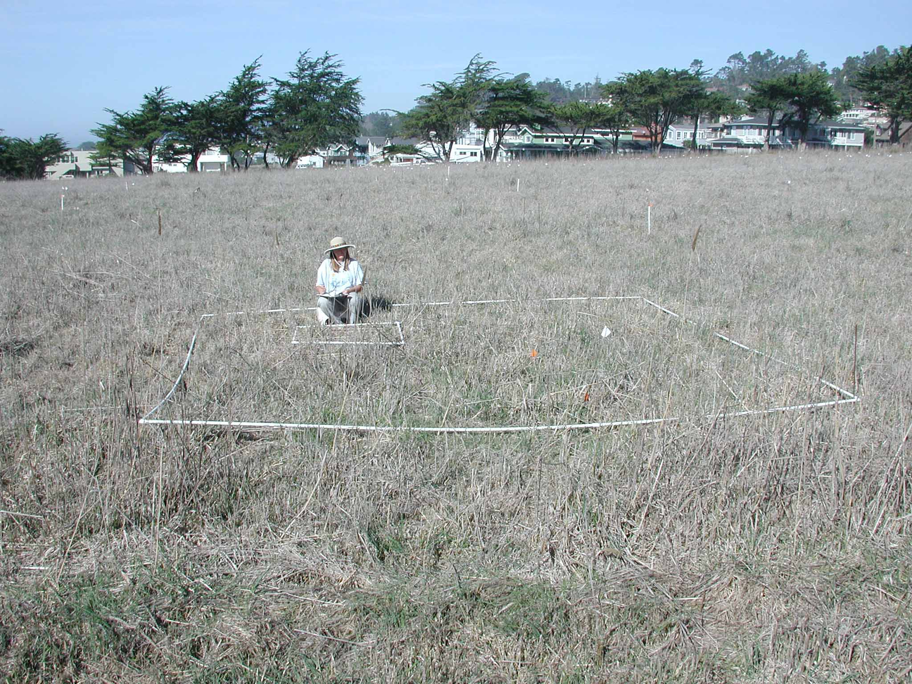

---
title:
author: "cjlortie. don canestro and eli swanson"
date: "September 16, 2016"
output:
  html_document:
    theme: yeti
    toc: yes
    toc_depth: 3
    toc_float: yes
  pdf_document:
    toc: yes
---

#A long-term restoration experiment at Rancho Marino Reserve.

###Purpose
To explore existing evidence and data empirically and assess future research activities including sampling for efficicacy of intervention on recruitment of natives into coastal grassland with extensive exotic plant representation.

###Methods
The control macroplots were not used.

From data sheet columns:
Plot   12x12m(12 setup & originally sampled, but as you noted control sites weren't uses) 
Subplot 3x3m (4 per plot)  
Quadrat 1x1m (5 per Subplot) 

###Macro meta-data
Don Canestro
In summary, 4 years of sampling 1 before and three after planning.
I also have data on plug grow out and which spp. seeds had best germination rates and plot images from 2006 and 2009.

Between 2002 before data and 2006 data collection was kill time.  I was told by restoration experts 3 years of death on a plot was good to remove seed bank and reduce competition

Below are descriptions of the attached files.
"harding grassexpt3_05.doc"   describes the experiment
"HARDINGGRASSPLOTS.xls" illustrates the plot layout.
"Percent cover data2002.xls"  is before treatment data
Other files self evident.
